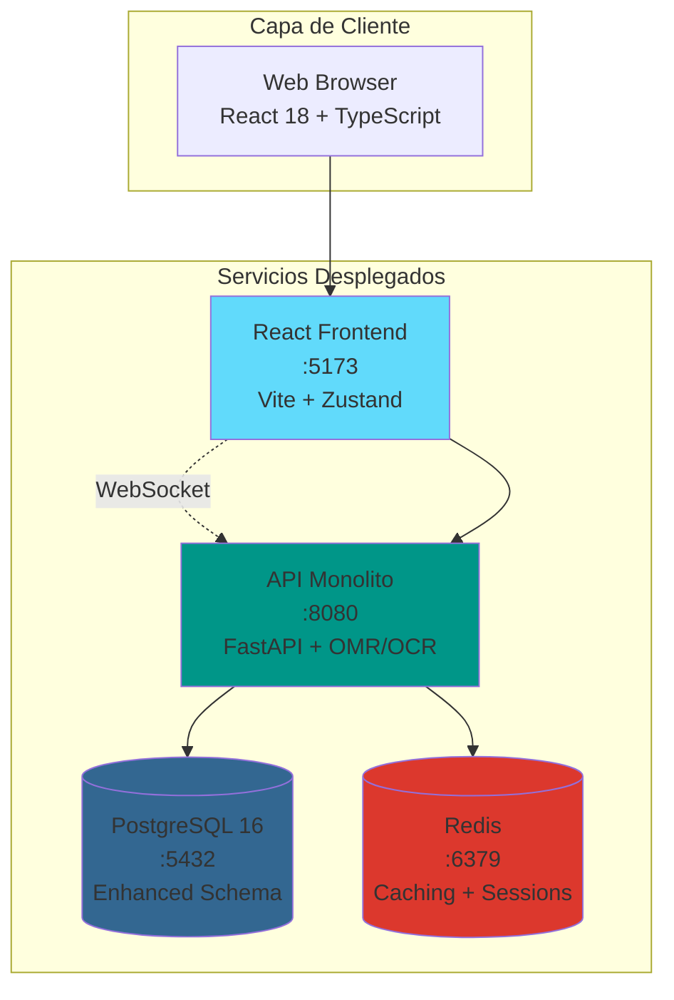
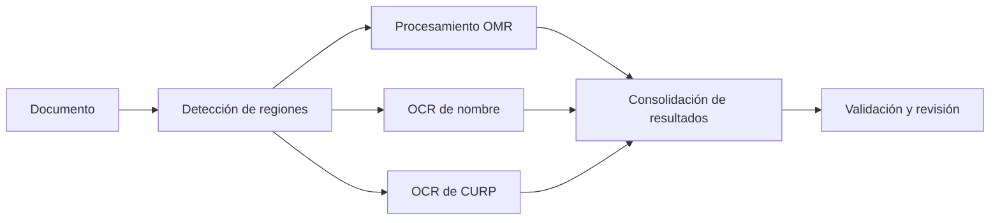

# 🫧 BubbleGrade – Procesamiento OCR+OMR de Documentos

**BubbleGrade** es un sistema **Reconocimiento Óptico de Marcas (OMR)**  y **Reconocimiento Óptico de Caracteres (OCR)** diseñado para la calificación automatizada de formularios de opción múltiple . Combina reconocimiento de escritura manuscrita, procesamiento de formularios de burbujas y análisis inteligente de documentos en una arquitectura de microservicios moderna.

[](https://opensource.org/licenses/MIT)
[](https://docker.com)
[](https://reactjs.org)
[](https://golang.org)
[](https://fastapi.tiangolo.com)
[](https://nodejs.org)

---

## 🚀 **Funcionalidades Revolucionarias**

### 🎯 **Capacidades Principales**
- **📝 Reconocimiento de Escritura a Mano** con OCR avanzado (Tesseract)
- **🆔 Extracción y Validación de CURP** con verificación de formato oficial
- **🔴 Detección en Tiempo Real de Burbujas** mediante OpenCV y Hough Circle
- **🤖 Detección Inteligente de Regiones** y segmentación automática de formularios
- **✏️ Interfaz de Corrección Manual** basada en niveles de confianza
- **📊 Análisis Completo** con métricas de calidad y rendimiento

### 🏗️ **Arquitectura Empresarial**
- **6 Microservicios Especializados** (Frontend React, Orquestador FastAPI, Servicio OMR en Go, OCR en Node.js, PostgreSQL, Redis)
- **Arquitectura Limpia** con principios SOLID y Diseño Dirigido por Dominio
- **Pipeline Asíncrono** con procesamiento paralelo de OMR y OCR
- **Actualizaciones en Tiempo Real** vía WebSocket
- **Esquema de Base de Datos Avanzado** con auditoría y métricas de rendimiento
- **Despliegue Docker-First** con health checks y escalado automático

### 🎨 **Experiencia de Usuario Moderna**
- **React 18 + TypeScript + Vite** con gestión de estado centralizada
- **Interfaz de Edición en Tiempo Real** con indicadores de confianza
- **Diseño Responsivo** optimizado para escritorio y móvil
- **Validación Avanzada de Archivos** con detección de duplicados
- **Opciones de Exportación Profesional** (Excel, CSV, PDF)

---

## 🏗️ **Arquitectura del Sistema**



### 📊 **Detalles mejorados del servicio**

| Servicio | Tecnología | Puerto | Propósito | Funciones clave |
|----------|------------|--------|-----------|-----------------|
| **Frontend** | React 18 + Vite + TypeScript + Zustand | 5173 | Interfaz de usuario | Edición en tiempo real, WebSocket, validación de CURP |
| **API (Monolito)** | FastAPI + SQLAlchemy + AsyncPG + OpenCV + Tesseract | 8080 | Orquestación y procesamiento | Pipeline asíncrono, detección de regiones, OMR/OCR embebidos, WebSocket |
| **Base de Datos** | PostgreSQL 16 + Esquema avanzado | 5432 | Persistencia de datos | Resultados OCR/OMR, auditoría, métricas de rendimiento |
| **Caché** | Redis 7 + Gestión de sesiones | 6379 | Rendimiento | Caché de resultados, almacenamiento de sesiones, rate limiting |

## 🆕 **Novedades de BubbleGrade v2**

### **🔥 Principales mejoras respecto a BubbleGrade v1**

| Característica | BubbleGrade (v1) | BubbleGrade (v2) | Mejora |
|---------------|------------------|----------------|-----------|
| **Reconocimiento de texto** | ❌ Ninguno | ✅ OCR avanzado | +∞ |
| **Tipos de documentos** | Solo hojas de burbujas | Nombres + CURP + Burbujas | +300% |
| **Flujo de procesamiento** | Secuencial | OMR + OCR en paralelo | +400% de velocidad |
| **Interfaz de usuario** | Carga básica | Suite de edición avanzada | +500% UX |
| **Validación** | Solo manual | Automatizada + manual | +200% de precisión |
| **Arquitectura** | 3 servicios | 6 servicios especializados | +100% de escalabilidad |

### **🎯 Aplicaciones en el mundo real**
- **🏫 Instituciones educativas**: Procesamiento automatizado de exámenes con identificación de estudiantes
- **🏛️ Agencias gubernamentales**: Validación de CURP para documentos oficiales
- **🏢 Formación corporativa**: Evaluación de empleados con seguimiento de asistencia
- **🩺 Formularios de atención médica**: Extracción de información de pacientes de formularios manuscritos
- **📋 Procesamiento de encuestas**: Análisis de formularios mixtos de burbujas y texto


## 🚀 **Inicio rápido**

### **Requisitos previos**
- **Docker** y **Docker Compose** instalados
- **4 GB de RAM** mínimo (8 GB recomendado)
- **Puertos disponibles**: 5173, 8080, 8090, 8100, 5432, 6379

### **Despliegue con un comando**
```bash
# Clonar y desplegar BubbleGrade
git clone <repository-url>
cd BubbleGrade
./deploy_bubblegrade.sh

# Probar el sistema
./test_bubblegrade.sh

# Acceder a la aplicación
open http://localhost:5173
```

### **Modo de desarrollo**
```bash
# Desarrollo local con hot reload
docker compose -f docker-compose.bubblegrade.yml -f compose.micro.yml up --build

# Servicios individuales
# Frontend
cd services/frontend
npm install
npm run dev

# API
cd ../api
python -m venv venv
source venv/bin/activate
pip install -r requirements.txt
uvicorn app.main_bubblegrade:app --reload --host 0.0.0.0 --port 8080

# Servicio OCR
cd ../ocr
npm install
npm run dev
```

## 📂 **Estructura del Proyecto**

```
BubbleGrade/
├── 📋 README.md                         # Documentación principal en español
├── 🐳 docker-compose.bubblegrade.yml    # Configuración de despliegue en producción
├── 🗄️ init_bubblegrade.sql             # Script de inicialización de la base de datos
├── 🚀 deploy_bubblegrade.sh             # Script de despliegue automatizado
├── 🧪 test_bubblegrade.sh               # Suite de pruebas integrales
├── 📚 docs/                             # Documentación Sphinx en español
│   ├── index.rst                        # Punto de entrada de la documentación
│   ├── getting-started.rst              # Guía de inicio rápido
│   ├── api.md                           # Documentación de la API
│   ├── architecture/                    # Carpeta de arquitectura del sistema
│   └── roadmap.rst                      # Hoja de ruta del proyecto
├── 🎨 services/frontend/                # Frontend en React 18 + TypeScript
│   ├── src/                             # Código fuente
│   │   ├── components/                  # Componentes React (UploadCard, EditableCell, ProgressDrawer)
│   │   ├── utils/curpValidator.ts       # Utilidades de validación de CURP
│   │   ├── services/api.ts              # Cliente HTTP y WebSocket
│   │   └── store/                       # Estado global con Zustand
│   ├── package.json                     # Dependencias y scripts
│   └── Dockerfile                       # Contenedor de producción
├── ⚡ services/api/                     # Servicio orquestador en FastAPI
│   ├── app/                             # Implementación de Arquitectura Limpia
│   │   ├── main_bubblegrade.py          # Aplicación principal FastAPI
│   │   ├── routers/                     # Rutas HTTP y WebSocket
│   │   ├── services/                    # Lógica de negocio (OCR/OMR, WS)
│   │   ├── crud/                        # Acceso a datos (repositorios)
│   │   └── infrastructure/              # Modelos, migraciones y configuración
│   ├── alembic/                         # Migraciones de base de datos
│   ├── requirements.txt                 # Dependencias Python
│   └── Dockerfile                       # Contenedor de producción
```  


## 🔄 **Flujo de procesamiento **

### **1. 📁 Carga y validación de documentos**
- Soporte de múltiples formatos (JPG, PNG, TIFF, PDF)
- Validación de integridad de archivos y detección de duplicados
- Evaluación de calidad de imagen y preprocesamiento

### **2. 🔍 Detección inteligente de regiones**
- Análisis automático de diseño con OpenCV
- Detección dinámica de límites de regiones
- Mapeo de regiones basado en plantillas para formatos conocidos

### **3. ⚡ Procesamiento en paralelo**


### **4. 🎯 Sistema de revisión inteligente**
- Disparadores de revisión automática basados en confianza
- Validación de formato de CURP con algoritmos oficiales
- Interfaz de corrección manual con resaltado de regiones

### **5. 📊 Resultados y análisis**
- Métricas completas de precisión
- Análisis de tiempo de procesamiento
- Recomendaciones de mejora de calidad

---

## 🔧 **Configuración mejorada**

### **Variables de entorno**
```bash
# Configuración de la base de datos
DATABASE_URL=postgresql+asyncpg://bubblegrade:secure_password@db:5432/bubblegrade

# URLs de microservicios
OMR_URL=http://omr:8090
OCR_URL=http://ocr:8100

# Seguridad
SECRET_KEY=your-secure-secret-key
ALLOWED_ORIGINS=http://localhost:5173

# Configuración de procesamiento
OCR_CONFIDENCE_THRESHOLD=0.8
CURP_VALIDATION_STRICT=true
MAX_PROCESSING_TIME=60

# Rendimiento
REDIS_URL=redis://redis:6379
CACHE_TTL=3600
RATE_LIMIT_PER_MINUTE=30
```

---

## 🧪 **Pruebas avanzadas**

### **Suite de pruebas completas**
```bash
# Ejecutar todas las pruebas
./test_bubblegrade.sh

# Pruebas de servicios individuales
curl -X POST http://localhost:8100/ocr \
  -F "image=@test_exam.jpg" \
  -F "request={\"region\":\"nombre\",\"boundingBox\":{\"x\":50,\"y\":100,\"width\":400,\"height\":40}}"

# Performance testing
ab -n 100 -c 10 http://localhost:8080/health

# Load testing with realistic data
for i in {1..10}; do
  curl -X POST http://localhost:8080/api/v1/scans \
    -F "file=@sample_exam_$i.jpg" &
done
```

### **Métricas de aseguramiento de calidad**
- **Precisión OCR**: > 95 % para CURP impreso, > 85 % para nombres escritos a mano
- **Velocidad de procesamiento**: < 30 segundos de extremo a extremo por documento
- **Confiabilidad del sistema**: 99.5 % de tiempo de actividad con comprobaciones de salud automatizadas
- **Escalabilidad**: Maneja más de 100 cargas concurrentes

---

## 📈 **Rendimiento y monitoreo**

### **Métricas integradas**
- Estadísticas de procesamiento en tiempo real
- Monitoreo de salud del servicio
- Detección de cuellos de botella de rendimiento
- Análisis de actividad de usuarios

### **Estrategia de escalado**
```yaml
# Kubernetes-ready configuration
replicas:
  frontend: 2
  api: 3
  omr: 4      # CPU intensivo
  ocr: 5      # Intensivo en memoria
  
resources:
  api: { memory: "1Gi", cpu: "500m" }
  omr: { memory: "2Gi", cpu: "1000m" }
  ocr: { memory: "3Gi", cpu: "500m" }
```

---

## 🔒 **Seguridad y cumplimiento**

### **Funciones de seguridad integradas**
- **Limitación de tasa**: Prevención de abusos con limitación inteligente
- **Validación de archivos**: Carga segura con verificación de formato
- **Saneamiento de entradas**: Prevención de ataques de inyección
- **Registro de auditoría**: Seguimiento completo de acciones
- **Cifrado de datos**: Protección en reposo y en tránsito

### **Cumplimiento mexicano**
- **Validación de CURP**: Implementación de algoritmo oficial
- **Privacidad de datos**: Cumplimiento con GDPR y protección de datos mexicana
- **Procesamiento seguro**: No retención de datos más allá de lo necesario

---

## 🤝 **Soporte empresarial**

### **Servicios profesionales de JazzDataSolutions**
- **🔧 Implementación personalizada**: Adaptada a las necesidades de su institución
- **📊 Integración de análisis**: Conexión con sistemas existentes
- **🎓 Capacitación y soporte**: Programas integrales de formación de usuarios
- **⚡ Optimización de rendimiento**: Escala según sus requisitos
- **🔒 Consultoría de seguridad**: Implementación de seguridad a nivel empresarial

### **Información de contacto**
- **Sitio web**: [jazzdatasolutions.com](https://jazzdatasolutions.com)
- **Correo electrónico**: contact@jazzdatasolutions.com
- **Soporte**: support@jazzdatasolutions.com
- **Ventas**: sales@jazzdatasolutions.com

---

## 📄 **Licencia y atribución**

Este proyecto está licenciado bajo la Licencia MIT. Consulte el archivo [LICENSE](LICENSE) para más detalles.

**Desarrollado con ❤️ por JazzDataSolutions**

*Transformando el procesamiento de documentos mediante automatización inteligente*

---

## 🎯 **Próximos pasos y hoja de ruta**

### **Inmediato (Sprint 1 completo)**
- ✅ Procesamiento híbrido OCR + OMR
- ✅ Interfaz de corrección manual en tiempo real
- ✅ Arquitectura de microservicios mejorada
- ✅ Despliegue listo para producción

### **Corto plazo (Q2 2024)**
- 📄 Generación de constancias en PDF con firmas digitales
- 🔗 Integración de CDN para optimizar el rendimiento
- 🔐 Autenticación y autorización empresarial
- 📊 Panel avanzado de análisis

### **Largo plazo (Q3-Q4 2024)**
- 🤖 Modelos de aprendizaje automático para mayor precisión
- 📱 Aplicación móvil para captura de documentos
- ☸️ Orquestación con Kubernetes y autoescalado
- 🌐 Soporte multilingüe e internacionalización

---

**¿Listo para revolucionar el procesamiento de sus documentos?**

**[Get Started Today](./deploy_bubblegrade.sh) | [View Demo](http://localhost:5173) | [Contact Sales](mailto:sales@jazzdatasolutions.com)**
