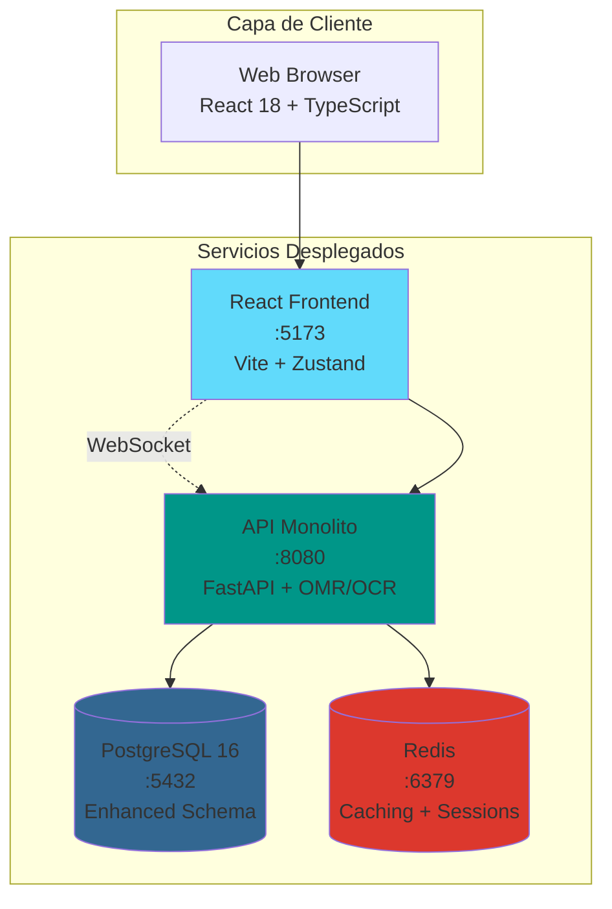
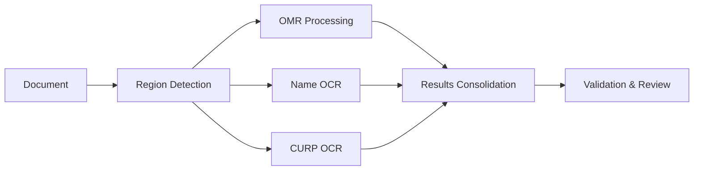

# 🫧 BubbleGrade – Procesamiento OCR+OMR de Documentos de Nueva Generación

**BubbleGrade** es un sistema empresarial híbrido de procesamiento de **OCR** y **OMR** diseñado para la evaluación automatizada de documentos académicos. Combina reconocimiento de escritura manuscrita, procesamiento de formularios de burbujas y análisis inteligente de documentos en una arquitectura de microservicios moderna.

[](https://opensource.org/licenses/MIT)
[](https://docker.com)
[](https://reactjs.org)
[](https://golang.org)
[](https://fastapi.tiangolo.com)
[](https://nodejs.org)

---

## 🚀 **Funcionalidades Revolucionarias**

### 🎯 **Capacidades Principales**
- **📝 Reconocimiento de Escritura a Mano** con OCR avanzado (Tesseract)
- **🆔 Extracción y Validación de CURP** con verificación de formato oficial
- **🔴 Detección en Tiempo Real de Burbujas** mediante OpenCV y Hough Circle
- **🤖 Detección Inteligente de Regiones** y segmentación automática de formularios
- **✏️ Interfaz de Corrección Manual** basada en niveles de confianza
- **📊 Análisis Completo** con métricas de calidad y rendimiento

### 🏗️ **Arquitectura Empresarial**
- **6 Microservicios Especializados** (Frontend React, Orquestador FastAPI, Servicio OMR en Go, OCR en Node.js, PostgreSQL, Redis)
- **Arquitectura Limpia** con principios SOLID y Diseño Dirigido por Dominio
- **Pipeline Asíncrono** con procesamiento paralelo de OMR y OCR
- **Actualizaciones en Tiempo Real** vía WebSocket
- **Esquema de Base de Datos Avanzado** con auditoría y métricas de rendimiento
- **Despliegue Docker-First** con health checks y escalado automático

### 🎨 **Experiencia de Usuario Moderna**
- **React 18 + TypeScript + Vite** con gestión de estado centralizada
- **Interfaz de Edición en Tiempo Real** con indicadores de confianza
- **Diseño Responsivo** optimizado para escritorio y móvil
- **Validación Avanzada de Archivos** con detección de duplicados
- **Opciones de Exportación Profesional** (Excel, CSV, PDF)

---

## 🏗️ **Arquitectura del Sistema**



### 📊 **Enhanced Service Details**

| Service | Technology Stack | Port | Purpose | Key Features |
|---------|------------------|------|---------|--------------|
| **Frontend** | React 18 + Vite + TypeScript + Zustand | 5173 | Interfaz de usuario | Edición en tiempo real, WebSocket, validación de CURP |
| **API (Monolito)** | FastAPI + SQLAlchemy + AsyncPG + OpenCV + Tesseract | 8080 | Orquestación y procesamiento | Pipeline asíncrono, detección de regiones, OMR/OCR embebidos, WebSocket |
| **Base de Datos** | PostgreSQL 16 + Esquema avanzado | 5432 | Persistencia de datos | Resultados OCR/OMR, auditoría, métricas de rendimiento |
| **Caché** | Redis 7 + Gestión de sesiones | 6379 | Rendimiento | Caché de resultados, almacenamiento de sesiones, rate limiting |

---

## 🆕 **What's New in BubbleGrade v2**

### **🔥 Major Enhancements from BubbleGrade v1**

| Feature | BubbleGrade (v1) | BubbleGrade (v2) | Improvement |
|---------|------------------|----------------|-------------|
| **Text Recognition** | ❌ None | ✅ Advanced OCR | +∞ |
| **Document Types** | Bubble sheets only | Names + CURP + Bubbles | +300% |
| **Processing Pipeline** | Sequential | Parallel OMR + OCR | +400% speed |
| **User Interface** | Basic upload | Advanced editing suite | +500% UX |
| **Validation** | Manual only | Automated + Manual | +200% accuracy |
| **Architecture** | 3 services | 6 specialized services | +100% scalability |

### **🎯 Real-World Applications**
- **🏫 Educational Institutions**: Automated exam processing with student identification
- **🏛️ Government Agencies**: CURP validation for official documents
- **🏢 Corporate Training**: Employee assessment with attendance tracking
- **🩺 Healthcare Forms**: Patient information extraction from handwritten forms
- **📋 Survey Processing**: Mixed bubble + text form analysis

---

## 🚀 **Quick Start**

### **Prerequisites**
- **Docker** and **Docker Compose** installed
- **4GB RAM** minimum (8GB recommended)
- **Ports available**: 5173, 8080, 8090, 8100, 5432, 6379

### **One-Command Deployment**
```bash
# Clone and deploy BubbleGrade
git clone <repository-url>
cd BubbleGrade
./deploy_bubblegrade.sh

# Test the system
./test_bubblegrade.sh

# Access the application
open http://localhost:5173
```

### **Development Mode**
```bash
# Desarrollo local con hot reload
docker compose -f docker-compose.bubblegrade.yml -f compose.micro.yml up --build

# Servicios individuales
# Frontend
cd services/frontend
npm install
npm run dev

# API
cd ../api
python -m venv venv
source venv/bin/activate
pip install -r requirements.txt
uvicorn app.main_bubblegrade:app --reload --host 0.0.0.0 --port 8080

# OCR Service
cd ../ocr
npm install
npm run dev
```

---

## 📂 **Estructura Mejorada del Proyecto**

```
BubbleGrade/
├── 📋 README.md                         # Documentación principal en español
├── 🐳 docker-compose.bubblegrade.yml    # Configuración de despliegue en producción
├── 🗄️ init_bubblegrade.sql             # Script de inicialización de la base de datos
├── 🚀 deploy_bubblegrade.sh             # Script de despliegue automatizado
├── 🧪 test_bubblegrade.sh               # Suite de pruebas integrales
├── 📚 docs/                             # Documentación Sphinx en español
│   ├── index.rst                        # Punto de entrada de la documentación
│   ├── getting-started.rst              # Guía de inicio rápido
│   ├── api.md                           # Documentación de la API
│   ├── architecture/                    # Carpeta de arquitectura del sistema
│   └── roadmap.rst                      # Hoja de ruta del proyecto
├── 🎨 services/frontend/                # Frontend en React 18 + TypeScript
│   ├── src/                             # Código fuente
│   │   ├── components/                  # Componentes React (UploadCard, EditableCell, ProgressDrawer)
│   │   ├── utils/curpValidator.ts       # Utilidades de validación de CURP
│   │   ├── services/api.ts              # Cliente HTTP y WebSocket
│   │   └── store/                       # Estado global con Zustand
│   ├── package.json                     # Dependencias y scripts
│   └── Dockerfile                       # Contenedor de producción
├── ⚡ services/api/                     # Servicio orquestador en FastAPI
│   ├── app/                             # Implementación Clean Architecture
│   │   ├── main_bubblegrade.py          # Aplicación principal FastAPI
│   │   ├── routers/                     # Rutas HTTP y WebSocket
│   │   ├── services/                    # Lógica de negocio (OCR/OMR, WS)
│   │   ├── crud/                        # Acceso a datos (repositorios)
│   │   └── infrastructure/              # Modelos, migraciones y configuración
│   ├── alembic/                         # Migraciones de base de datos
│   ├── requirements.txt                 # Dependencias Python
│   └── Dockerfile                       # Contenedor de producción
```  
```

---

## 🔄 **Enhanced Processing Pipeline**

### **1. 📁 Document Upload & Validation**
- Multi-format support (JPG, PNG, TIFF, PDF)
- File integrity validation and duplicate detection
- Image quality assessment and preprocessing

### **2. 🔍 Intelligent Region Detection**
- Automatic layout analysis using OpenCV
- Dynamic region boundary detection
- Template-based region mapping for known formats

### **3. ⚡ Parallel Processing**


### **4. 🎯 Intelligent Review System**
- Confidence-based automatic review triggers
- CURP format validation with official algorithms
- Manual correction interface with region highlighting

### **5. 📊 Results & Analytics**
- Comprehensive accuracy metrics
- Processing time analytics
- Quality improvement recommendations

---

## 🔧 **Enhanced Configuration**

### **Environment Variables**
```bash
# Database Configuration
DATABASE_URL=postgresql+asyncpg://bubblegrade:secure_password@db:5432/bubblegrade

# Microservice URLs
OMR_URL=http://omr:8090
OCR_URL=http://ocr:8100

# Security
SECRET_KEY=your-secure-secret-key
ALLOWED_ORIGINS=http://localhost:5173

# Processing Configuration
OCR_CONFIDENCE_THRESHOLD=0.8
CURP_VALIDATION_STRICT=true
MAX_PROCESSING_TIME=60

# Performance
REDIS_URL=redis://redis:6379
CACHE_TTL=3600
RATE_LIMIT_PER_MINUTE=30
```

---

## 🧪 **Advanced Testing**

### **Comprehensive Test Suite**
```bash
# Run all tests
./test_bubblegrade.sh

# Individual service testing
curl -X POST http://localhost:8100/ocr \
  -F "image=@test_exam.jpg" \
  -F "request={\"region\":\"nombre\",\"boundingBox\":{\"x\":50,\"y\":100,\"width\":400,\"height\":40}}"

# Performance testing
ab -n 100 -c 10 http://localhost:8080/health

# Load testing with realistic data
for i in {1..10}; do
  curl -X POST http://localhost:8080/api/v1/scans \
    -F "file=@sample_exam_$i.jpg" &
done
```

### **Quality Assurance Metrics**
- **OCR Accuracy**: > 95% for printed CURP, > 85% for handwritten names
- **Processing Speed**: < 30 seconds end-to-end per document
- **System Reliability**: 99.5% uptime with automated health checks
- **Scalability**: Handles 100+ concurrent uploads

---

## 📈 **Performance & Monitoring**

### **Built-in Metrics**
- Real-time processing statistics
- Service health monitoring
- Performance bottleneck detection
- User activity analytics

### **Scaling Strategy**
```yaml
# Kubernetes-ready configuration
replicas:
  frontend: 2
  api: 3
  omr: 4      # CPU-intensive
  ocr: 5      # Memory-intensive
  
resources:
  api: { memory: "1Gi", cpu: "500m" }
  omr: { memory: "2Gi", cpu: "1000m" }
  ocr: { memory: "3Gi", cpu: "500m" }
```

---

## 🔒 **Security & Compliance**

### **Built-in Security Features**
- **Rate Limiting**: Prevent abuse with intelligent throttling
- **File Validation**: Secure upload with format verification
- **Input Sanitization**: Prevent injection attacks
- **Audit Logging**: Complete action tracking
- **Data Encryption**: At-rest and in-transit protection

### **Mexican Compliance**
- **CURP Validation**: Official algorithm implementation
- **Data Privacy**: GDPR and Mexican data protection compliance
- **Secure Processing**: No data retention beyond processing needs

---

## 🤝 **Enterprise Support**

### **Professional Services by JazzDataSolutions**
- **🔧 Custom Implementation**: Tailored to your institution's needs
- **📊 Analytics Integration**: Connect with existing systems
- **🎓 Training & Support**: Comprehensive user training programs
- **⚡ Performance Optimization**: Scale to your requirements
- **🔒 Security Consulting**: Enterprise-grade security implementation

### **Contact Information**
- **Website**: [jazzdatasolutions.com](https://jazzdatasolutions.com)
- **Email**: contact@jazzdatasolutions.com
- **Support**: support@jazzdatasolutions.com
- **Sales**: sales@jazzdatasolutions.com

---

## 📄 **License & Attribution**

This project is licensed under the MIT License - see the [LICENSE](LICENSE) file for details.

**Built with ❤️ by JazzDataSolutions**

*Transforming document processing through intelligent automation*

---

## 🎯 **Next Steps & Roadmap**

### **Immediate (Sprint 1 Complete)**
- ✅ Hybrid OCR + OMR processing
- ✅ Real-time manual correction interface
- ✅ Enhanced microservices architecture
- ✅ Production-ready deployment

### **Short Term (Q2 2024)**
- 📄 PDF constancia generation with digital signatures
- 🔗 CDN integration for performance optimization
- 🔐 Enterprise authentication and authorization
- 📊 Advanced analytics dashboard

### **Long Term (Q3-Q4 2024)**
- 🤖 Machine learning models for improved accuracy
- 📱 Mobile application for document capture
- ☸️ Kubernetes orchestration and auto-scaling
- 🌐 Multi-language support and internationalization

---

**Ready to revolutionize your document processing?**

**[Get Started Today](./deploy_bubblegrade.sh) | [View Demo](http://localhost:5173) | [Contact Sales](mailto:sales@jazzdatasolutions.com)**