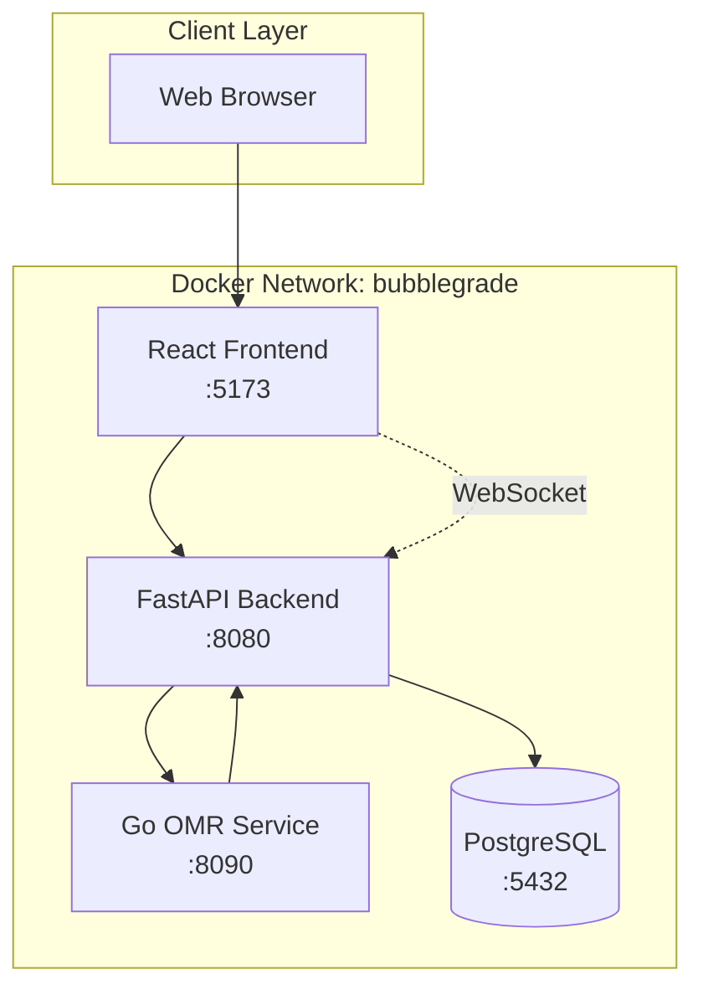

# 🫧 BubbleGrade – Advanced Microservices OMR System

**BubbleGrade** is a production-ready **Optical Mark Recognition (OMR)** system designed for automated grading of bubble sheets and multiple-choice exams. Built with modern microservices architecture, it combines the power of **OpenCV computer vision**, **real-time WebSocket communication**, and **beautiful React interfaces**.

[](https://opensource.org/licenses/MIT)
[](https://docker.com)
[](https://reactjs.org)
[](https://golang.org)
[](https://fastapi.tiangolo.com)

---

## ✨ Features

### 🎯 **Core Capabilities**
- **Real-time Bubble Detection** using OpenCV and Hough Circle Transform
- **Drag-and-Drop File Upload** with instant processing feedback
- **Live Progress Updates** via WebSocket connections
- **Professional Excel Export** with detailed results and formatting
- **PostgreSQL Database** for persistent scan history
- **RESTful API** with comprehensive endpoints

### 🏗️ **Architecture**
- **Clean Architecture** with SOLID principles implementation
- **Microservices Design** with independent, scalable services
- **Container-First** approach with Docker Compose orchestration
- **Health Checks** and service dependency management
- **Production-Ready** with proper logging, error handling, and monitoring
- **Domain-Driven Design** with clear separation of concerns

### 🎨 **User Experience**
- **Modern React Interface** with TypeScript and Vite
- **Responsive Design** that works on desktop and mobile
- **Real-time Status Updates** during scan processing
- **Beautiful Gradient UI** with smooth animations

---

## 🏗️ System Architecture



### 📊 **Service Details**

| Service | Technology | Port | Purpose | Key Features |
|---------|------------|------|---------|--------------|
| **Frontend** | React 18 + Vite + TypeScript | 5173 | User Interface | Drag-drop, real-time updates, responsive |
| **API** | FastAPI + SQLAlchemy + AsyncPG | 8080 | Backend Logic | REST endpoints, WebSocket, database ORM |
| **OMR** | Go + OpenCV (gocv) | 8090 | Image Processing | Circle detection, bubble analysis, scoring |
| **Database** | PostgreSQL 16 | 5432 | Data Persistence | Scan results, user data, audit logs |

---

## 🚀 Quick Start

### Prerequisites
- **Docker** and **Docker Compose** installed
- At least **4GB RAM** available for containers
- **Ports 5173, 8080, 8090, 5432** available

### Launch the System
```bash
# Clone the repository
git clone <repository-url>
cd BubbleGrade

# Start all services
docker compose -f compose.micro.yml up --build

# Access the application
open http://localhost:5173
```

### First Test
1. Navigate to http://localhost:5173
2. Drag and drop a bubble sheet image (JPG/PNG)
3. Watch real-time processing status
4. Download Excel results when complete

---

## 📂 Project Structure

```
BubbleGrade/
├── 📋 README.md                    # This file
├── 🐳 compose.micro.yml             # Docker Compose configuration
├── 🗄️ init.sql                     # Database initialization
├── 📚 docs/                        # Comprehensive documentation
│   ├── architecture.md             # System architecture details
│   ├── api.md                      # API documentation
│   ├── deployment.md               # Deployment guides
│   └── development.md              # Development setup
├── 🎨 services/frontend/           # React TypeScript frontend
│   ├── src/App.tsx                 # Main application component
│   ├── src/App.css                 # Styling and animations
│   ├── Dockerfile                  # Multi-stage build
│   ├── nginx.conf                  # Production web server config
│   └── package.json               # Dependencies
├── ⚡ services/api/                # FastAPI backend
│   ├── app/main.py                 # Main application logic
│   ├── requirements.txt            # Python dependencies
│   └── Dockerfile                  # API container build
└── 🔍 services/omr/               # Go OMR processing service
    ├── main.go                     # OpenCV image processing
    ├── go.mod                      # Go module definition
    ├── go.sum                      # Dependency checksums
    └── Dockerfile                  # Multi-stage Go build
```

---

## 🛠️ Development

### Frontend Development
```bash
cd services/frontend
npm install
npm run dev          # Development server at localhost:5173
npm run build        # Production build
npm run preview      # Preview production build
```

### Backend API Development
```bash
cd services/api
pip install -r requirements.txt
uvicorn app.main:app --reload --host 0.0.0.0 --port 8080
```

### OMR Service Development
```bash
cd services/omr
go mod download
go run main.go       # Standalone service
go test ./...        # Run tests
```

---

## 🔄 Processing Pipeline

### 1. **File Upload**
- User drags/drops image file to React interface
- File validated (format, size) on client-side
- FormData uploaded to `/api/scans` endpoint

### 2. **Database Record Creation**
- Unique scan ID generated (UUID)
- Database record created with QUEUED status
- Background task initiated for processing

### 3. **Image Processing**
- File sent to Go OMR service via HTTP
- OpenCV processes image:
  - Convert to grayscale
  - Apply Gaussian blur
  - Detect circles using Hough transform
  - Analyze circle fill intensity
  - Organize answers by row/column

### 4. **Results & Scoring**
- Detected answers compared to answer key
- Score calculated as percentage
- Results stored in database
- WebSocket notification sent to frontend

### 5. **Excel Export**
- Professional spreadsheet generated with:
  - Question-by-question breakdown
  - Correct/incorrect indicators with colors
  - Summary statistics
  - Formatted headers and styling

---

## 📊 API Endpoints

### Core Endpoints
- `POST /api/scans` - Upload new scan
- `GET /api/scans` - List all scans
- `GET /api/scans/{id}` - Get specific scan
- `GET /api/exports/{id}` - Download Excel report
- `WebSocket /ws` - Real-time updates

### Health & Monitoring
- `GET /health` - API health check
- `GET /omr/health` - OMR service health

---

## 🐳 Docker Configuration

### Production Deployment
```bash
# Production with resource limits
docker compose -f compose.micro.yml up -d

# View logs
docker compose -f compose.micro.yml logs -f

# Scale OMR service for high load
docker compose -f compose.micro.yml up -d --scale omr=3
```

### Development with Hot Reload
```bash
# Override for development
docker compose -f compose.micro.yml -f compose.dev.yml up
```

---

## 🔧 Configuration

### Environment Variables

#### API Service
```env
DATABASE_URL=postgresql+asyncpg://omr:omr@db/omr
OMR_URL=http://omr:8090/grade
SECRET_KEY=your-secret-key
LOG_LEVEL=INFO
```

#### OMR Service
```env
PORT=8090
OMR_THREADS=4
OPENCV_LOG_LEVEL=ERROR
```

#### Frontend
```env
VITE_API_BASE=/api
VITE_WS_URL=ws://localhost:8080/ws
```

---

## 🧪 Testing

### Automated Testing
```bash
# Run all tests
make test

# Test individual services
make test-frontend
make test-api
make test-omr
```

### Manual Testing
1. Use sample bubble sheets from `test-data/`
2. Test various image formats (JPG, PNG)
3. Verify WebSocket updates work correctly
4. Check Excel export formatting

---

## 📈 Performance & Scaling

### Resource Requirements
- **Memory**: 2GB minimum, 4GB recommended
- **CPU**: 2 cores minimum for OMR processing
- **Storage**: 10GB for database and temporary files

### Scaling Strategies
- **Horizontal OMR Scaling**: Add more OMR service replicas
- **Database Optimization**: Read replicas, connection pooling
- **Frontend CDN**: Serve static assets from CDN
- **Load Balancing**: NGINX for multiple API instances

---

## 🔒 Security

### Built-in Security Features
- **CORS Configuration** for cross-origin requests
- **Input Validation** on all API endpoints
- **File Type Validation** to prevent malicious uploads
- **Database Parameterization** to prevent SQL injection
- **Environment-based Secrets** management

### Production Recommendations
- Use HTTPS with proper SSL certificates
- Implement authentication/authorization
- Regular security updates for base images
- Network segmentation in production

---

## 📚 Documentation

Complete documentation available in the `docs/` directory:

- **[Architecture Guide](docs/architecture.md)** - Detailed system design
- **[API Documentation](docs/api.md)** - Complete API reference
- **[Deployment Guide](docs/deployment.md)** - Production deployment
- **[Development Setup](docs/development.md)** - Local development

---

## 🤝 Contributing

We welcome contributions! Please see our [Contributing Guide](CONTRIBUTING.md) for details.

1. Fork the repository
2. Create a feature branch (`git checkout -b feature/amazing-feature`)
3. Commit your changes (`git commit -m 'Add amazing feature'`)
4. Push to the branch (`git push origin feature/amazing-feature`)
5. Open a Pull Request

---

## 📄 License

This project is licensed under the MIT License - see the [LICENSE](LICENSE) file for details.

---

## 🚀 Next Steps - Architectural Roadmap

As a **Senior Solutions Architect**, the following strategic improvements are recommended for production readiness and enterprise scalability:

### Phase 1: Core Infrastructure (Q1-Q2)
#### 🔐 Security & Authentication
- **JWT Authentication** with role-based access control (RBAC)
- **OAuth 2.0 / OIDC** integration for enterprise SSO
- **API Gateway** with rate limiting and throttling
- **Secret Management** using HashiCorp Vault or AWS Secrets Manager
- **TLS/SSL** termination and certificate management

#### 📊 Observability & Monitoring
- **Distributed Tracing** with OpenTelemetry/Jaeger
- **Metrics Collection** with Prometheus + Grafana
- **Centralized Logging** with ELK Stack or Fluentd
- **Health Checks** and service mesh readiness
- **APM Integration** with DataDog or New Relic

#### 🗄️ Data Layer Enhancement
- **Database Migrations** with Alembic versioning
- **Read Replicas** for query optimization
- **Connection Pooling** with PgBouncer
- **Backup & Recovery** strategies
- **Data Encryption** at rest and in transit

### Phase 2: Scalability & Performance (Q2-Q3)
#### ⚡ High Availability
- **Load Balancing** with NGINX or HAProxy
- **Auto-scaling** with Kubernetes HPA
- **Circuit Breakers** with Hystrix pattern
- **Caching Layer** with Redis/Memcached
- **CDN Integration** for static assets

#### 🧪 Advanced OMR Processing
- **OpenCV Integration** for real bubble detection
- **ML Model Pipeline** for improved accuracy
- **GPU Acceleration** for batch processing
- **Image Preprocessing** optimization
- **Multi-format Support** (PDF, TIFF, etc.)

#### 📋 Enterprise Features
- **Multi-tenancy** support with tenant isolation
- **Exam Templates** management system
- **Bulk Processing** with message queues
- **Answer Key Management** with validation
- **Report Customization** engine

### Phase 3: DevOps & Platform (Q3-Q4)
#### 🔄 CI/CD Pipeline
- **GitOps** with ArgoCD or Flux
- **Automated Testing** (unit, integration, e2e)
- **Security Scanning** with Trivy/Snyk
- **Performance Testing** with K6
- **Blue-Green Deployments**

#### ☁️ Cloud Native
- **Kubernetes** deployment with Helm charts
- **Service Mesh** with Istio or Linkerd
- **Cloud Provider** integration (AWS/GCP/Azure)
- **Infrastructure as Code** with Terraform
- **Cost Optimization** and resource management

#### 🔍 Advanced Analytics
- **Real-time Dashboards** for system metrics
- **Usage Analytics** and user behavior tracking
- **Predictive Maintenance** for system health
- **Performance Optimization** recommendations
- **Business Intelligence** integration

### Phase 4: AI/ML Integration (Q4+)
#### 🤖 Machine Learning
- **Computer Vision Models** for enhanced bubble detection
- **OCR Integration** for handwritten text recognition
- **Anomaly Detection** for scan quality validation
- **Predictive Analytics** for performance insights
- **MLOps Pipeline** for model deployment and monitoring

#### 📈 Advanced Features
- **Multi-language Support** with i18n
- **Mobile Applications** with React Native
- **API Marketplace** with third-party integrations
- **Workflow Engine** for custom processing pipelines
- **Analytics Platform** for educational insights

---

## 🏗️ Implementation Priority Matrix

| Priority | Component | Impact | Effort | Dependencies |
|----------|-----------|---------|--------|--------------|
| **HIGH** | Authentication & Authorization | Security | Medium | Identity Provider |
| **HIGH** | Monitoring & Observability | Operations | Medium | Infrastructure |
| **HIGH** | Database Optimization | Performance | Low | PostgreSQL |
| **MEDIUM** | Real OMR Processing | Core Feature | High | OpenCV, ML Models |
| **MEDIUM** | Load Balancing & Scaling | Performance | Medium | Kubernetes |
| **MEDIUM** | Advanced Caching | Performance | Low | Redis |
| **LOW** | ML/AI Integration | Innovation | High | Data Science Team |
| **LOW** | Mobile Applications | UX | High | Mobile Team |

---

## 🆘 Support

- **Issues**: [GitHub Issues](https://github.com/your-org/bubblegrade/issues)
- **Discussions**: [GitHub Discussions](https://github.com/your-org/bubblegrade/discussions)
- **Documentation**: [Full Documentation](docs/)
- **Architecture**: [System Design](docs/architecture.md)

---

**Built with ❤️ by the BubbleGrade Team**

*Transforming education through technology, one bubble at a time.*