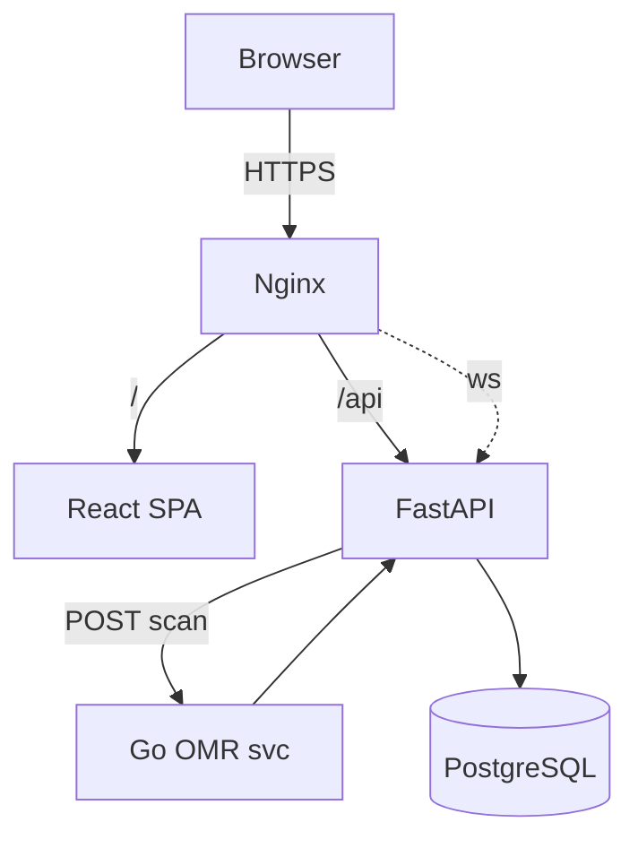

# BubbleGrade – Compose Microservices Edition

BubbleGrade now splits heavy image processing into a **Go microservice** and keeps the
**React + TypeScript** frontend in its own container—yet everything still launches
with a _single_ `docker compose up`.

---

## 🏗️ Services

| Service | Lang | Port | Description |
|---------|------|------|-------------|
| **frontend** | React 18 + Vite (TS) | 5173 | Drag‑and‑drop UI |
| **api** | Python 3.11 (FastAPI) | 8080 | REST/WS orchestration + Excel |
| **omr** | Go 1.22 + gocv | 8090 | CPU‑intensive bubble detection |
| **db** | Postgres 16 | 5432 | Persistent storage |
| **(opt) nginx** | — | 443 | TLS & reverse proxy |

---

## 🖥️ Architecture



All containers live in the same Docker network created by Compose.

---

## 🔧 Quick Start

```bash
git clone https://github.com/<org>/bubblegrade.git
cd BubbleGrade
docker compose -f compose.micro.yml up --build
open http://localhost:5173
```

_Note_: `compose.micro.yml` extends the default compose file with the `omr`
and `frontend` services.

---

## 📂 Repo Layout

```
BubbleGrade/
├─ docker-compose.yml
├─ services/
│  ├─ api/          # FastAPI (as before)
│  ├─ omr/          # Go microservice
│  └─ frontend/     # React+TS source
└─ docs/
    └─ architecture.md
```

---

## 🚀 Development 

* **Frontend**  
  ```bash
  cd services/frontend
  npm i
  npm run dev            # localhost:5173
  ```

* **Backend API**  
  `make dev-api` – hot reload w/ uvicorn

* **OMR service**  
  ```bash
  cd services/omr
  go test ./...
  go run main.go         # standalone debug
  ```

---

## 🔄 Data Flow

1. UI uploads a PDF/JPG → `POST /api/scans`.  
2. API streams file to `/tmp` and issues `POST /grade` to OMR service.  
3. OMR detects bubbles, returns answers + score.  
4. API stores result, emits WebSocket event back to UI.  
5. User clicks **Export** → API generates Excel and sends file.

---

## 📜 .env sample

```dotenv
# FastAPI
SECRET_KEY=replace-me
DATABASE_URL=postgresql+asyncpg://omr:omr@db/omr

# OMR
OMR_PORT=8090

# Frontend
VITE_API_BASE=/api
```

---

## 🔍 Testing & CI

* Py side: `pytest -q`, Go side: `go test`.  
* GitHub Actions matrix ⟶ lint, test, build multi‑arch images, push to GHCR.

---

MIT License · *Amor Fati*
