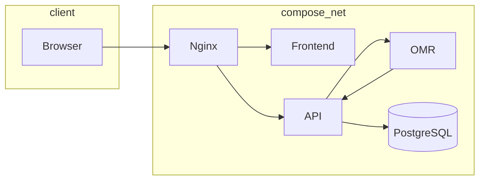

# Architecture – Compose Microservices


---

## 1. Container view



---

## 2. docker-compose.yml (excerpt)

```yaml
services:
  frontend:
    build: ./services/frontend
    ports: ["5173:5173"]
    environment:
      - VITE_API_BASE=/api

  api:
    build: ./services/api
    ports: ["8080:8080"]
    environment:
      - DATABASE_URL=postgresql+asyncpg://omr:omr@db/omr
    depends_on: [db, omr]

  omr:
    build: ./services/omr
    ports: ["8090:8090"]
    environment:
      - OMR_THREADS=4

  db:
    image: postgres:16-alpine
    volumes:
      - db_data:/var/lib/postgresql/data
volumes:
  db_data:
```

---

## 3. Sequence diagram

```mermaid
sequenceDiagram
  participant UI
  participant API
  participant OMR
  participant DB

  UI->>API: upload scan
  API->>OMR: HTTP /grade
  OMR-->>API: answers + score
  API->>DB: store results
  UI--WS>>API: wait progress
  API-->>UI: completed event
  UI->>API: GET /export/{exam}
  API-->>UI: Excel file
```

---

## 4. Scaling pointers

| Service | Horizontal scale | Trigger |
|---------|-----------------|---------|
| frontend | static, served by nginx | CDN out‑of‑box |
| api | Gunicorn workers | CPU > 70 % |
| omr | replicas | > 40 scans/min |
| db | managed pg pool | data > 5 GB |

---

*Maintained by BubbleGrade architecture team.*
