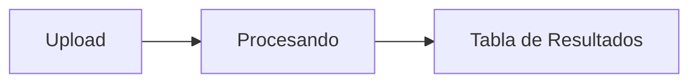
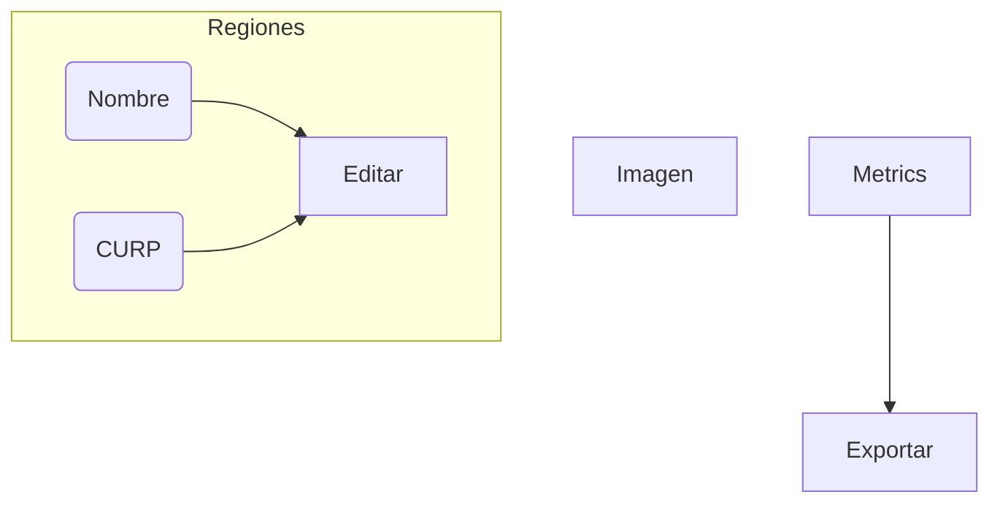
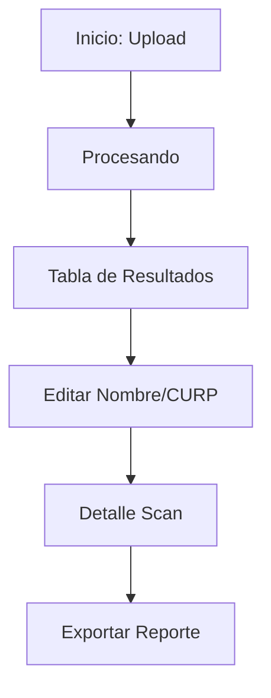

# Diseño de Interfaz Frontend para BubbleGrade

## 1️⃣ Principios de Diseño
- Claridad: información y acciones evidentes a primera vista.
- Feedback inmediato: respuesta visual/sonora a cada interacción.
- Accesibilidad (WCAG 2.1 AA): etiquetas ARIA, contraste ≥ 4.5:1, navegación teclado.
- Consistencia: uso uniforme de estilos, componentes y patrones.
- Responsive y Mobile-First: adaptarse a móviles, tablets y desktop.

## 2️⃣ Mapa de Navegación
- `/` : Upload / Inicio
- `/progress` : Progreso en Tiempo Real
- `/scans` : Tabla de Resultados
- `/scans/:id` : Detalle de Scan
- `/reports` : Reportes y Exportación
- `/settings` : Ajustes (Plantillas, Coordenadas)

## 3️⃣ Lista de Pantallas

### 3.1 Upload / Inicio (`/`)
- Objetivo: permitir arrastrar o seleccionar imágenes/PDFs.
- KPI: número de uploads exitosos, tasa de error de formato.
- Wireframe (ASCII):
```
┌──────────────────────────────┐
│  📄 Arrastra y suelta tu hoja │
│  [Seleccionar Archivos]      │
│  Formatos: JPG, PNG, PDF     │
└──────────────────────────────┘
```
- Componentes: `<UploadCard>`, botón, icono, mensajes de error.
- Estados: vacío, hover/dragging, error de formato, éxito.
- Accesible: role="button", tabindex, feedback ARIA live.

### 3.2 Progreso en Tiempo Real (`/progress`)
- Objetivo: mostrar barras de progreso globales.
- KPI: tiempo medio de procesamiento, porcentaje completado.
- Wireframe (Mermaid):

- Componentes: ProgressBar, lista de tareas.
- Estados: procesando, cancelado, fallo.
- Responsive: barras full-width en móvil.

### 3.3 Tabla de Resultados (`/scans`)
- Objetivo: listar scans con columnas editables.
- KPI: tiempo de corrección manual, porcentaje completado sin revisión.
- Wireframe:
```
┌────────────────────────────────────────────┐
│ Filename │ Status │ Nombre │ CURP │ Score │
├──────────┼────────┼────────┼───────┼───────┤
│ demo.jpg │ OK     │ [edit] │ [edit]│ 85    │
└────────────────────────────────────────────┘
```
- Componentes: `<Table>`, `<EditableCell>`, íconos de estado.
- Estados: loading (skeleton), vacío, error de carga.
- Accesible: role="grid", focus en celdas.

### 3.4 Detalle de Scan (`/scans/:id`)
- Objetivo: revisar imagen, regiones, métricas y editar datos.
- KPI: exactitud OCR, tiempo de corrección.
- Wireframe (Mermaid):

- Componentes: `<NameCURPEditor>`, visor de imagen con overlays.
- Estados: loading datos, error fetch, edición activa.
- Responsive: 1col móvil, 2col desktop.

### 3.5 Reportes / Exportación (`/reports`)
- Objetivo: generar y descargar reportes (XLSX, CSV, PDF).
- KPI: número descargas, errores de exportación.
- Wireframe:
```
┌────────────┐
│ [Generar]  │
│ Formato: v │
└────────────┘
```
- Componentes: `<Select>`, `<Button>`, toast.
- Estados: listo, generando (spinner), éxito, fallo.
- Accesible: aria-busy, roles adecuados.

### 3.6 Ajustes (`/settings`)
- Objetivo: definir plantillas de examen y regiones.
- KPI: número plantillas creadas, uso de plantillas.
- Wireframe (ASCII):
```
┌────────────┬────────┐
│ Plantilla  │ Editar │
├────────────┼────────┤
│ Nueva      │ Crear  │
└────────────┴────────┘
```
- Componentes: formularios, modales.
- Estados: validación, loading, éxito.
- Accesible: labels for, aria-invalid.

## 4️⃣ Flow de Usuario


## 5️⃣ Sistema Visual
- **Paleta**:
  - Primario: #009688 (teal) (contraste 4.8:1 vs #fff)
  - Secundario: #61dafb
  - Fondo: #f5f5f5, Blanco: #ffffff
  - Texto: #212121, Gris: #757575
- **Tipografía**: Inter, sans-serif; h1 2rem, h2 1.5rem, body 1rem
- **Grid & Spacing**: base 8px; xs 4px, sm 8px, md 16px, lg 24px, xl 32px
- **Componentes**:
  - Botones: primary, secondary; border-radius 4px; hover lighten(10%)
  - Inputs: border 1px #ccc; focus outline 2px primary
  - Feedback: success #4caf50; error #f44336

## 6️⃣ Design Tokens (JSON)
```json
{
  "color":{ "primary":"#009688","secondary":"#61dafb","bg":"#f5f5f5","text":"#212121","success":"#4caf50","error":"#f44336" },
  "spacing":{ "xs":4,"sm":8,"md":16,"lg":24,"xl":32 },
  "fontSize":{ "h1":32,"h2":24,"body":16,"small":14 },
  "borderRadius":4,
  "shadow":"0 1px 3px rgba(0,0,0,0.2)"
}
```

## 7️⃣ Componentes Reutilizables
- **`<UploadCard>`**
  - Props:
    ```ts
    interface UploadCardProps { onFiles: (files: File[])=>void; accept?:string; maxSizeMB?:number; }
    ```
  - UI: área drag-n-drop, botón, icono, mensajes, progress.
- **`<EditableCell>`**
  - Props:
    ```ts
    interface EditableCellProps<T> { value:T; onSave:(v:T)=>Promise<void>; validator?:(v:T)=>string|null; }
    ```
  - UI: view vs edit, save/cancel.

## 8️⃣ Micro-Interacciones
- Drag-n-drop: borde animado 200ms.
- ProgressBar: width transition 200ms ease.
- Toast: slide-in/out 200ms, auto-dismiss 3s.

## 9️⃣ Hand-off a Dev
- **Dependencias**: AntD/Chakra UI, React Hook Form, Zustand, WebSocket.
- **Accesibilidad**:
  - `aria-label`, `role`, `tabindex` en controles.
  - Contraste ≥4.5:1.
  - Focus visible, ARIA-live.

## 🔟 Futuras Extensiones
- Dashboard analítico con gráficos.
- Multi-idioma (i18n) y Dark Mode.
- Autenticación SSO y gestión usuarios.